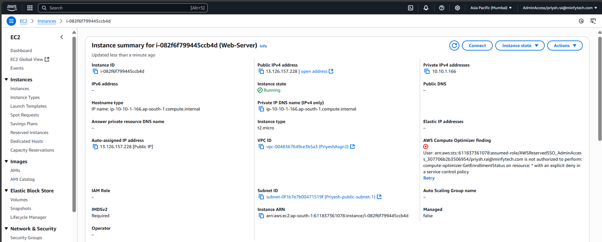

## Deploying a Secure, Public Web Server on AWS

## Step 0: Create a Key Pair


---

## Step 1: Create a VPC

- **Name:** `PriyeshRaiAsg2-vpc`
- **CIDR Block:** `10.0.0.0/16`


---

## Step 2: Create a Public Subnet

- **Name:** `PriyeshRaiMinfy-subnet`
- **CIDR Block:** `10.0.1.0/24`
- **Availability Zone:** `ap-south-1a` or first in list


---

## Step 3: Create and Attach Internet Gateway

- **Name:** `PriyeshRaiMinfy-igw`


---

## Step 4: Configure Route Table


---

## Step 5: Create a Security Group

- **Name:** `PriyeshRaiMinfy-sg`
- **Inbound Rules:**
  - **SSH (22):** My IP
  - **HTTP (80):** Anywhere (0.0.0.0/0)
- **VPC:** `my-lab-vpc`




---

## Step 6: Launch EC2 Instance

- **Instance Type:** `t2.micro`
- **Key Pair:** `Asg2-kp`

- **Network Settings:**
  - VPC: `PriyeshRai-vpc`
  - Subnet: `PriyeshRai-subnet`
  - Public IP: Enabled
  - Security Group: `PriyeshRai-sg`


---

### -> User Data Script

```bash
#!/bin/bash
yum update -y
yum install -y httpd
systemctl start httpd
systemctl enable httpd
echo "<h1>Hello i am Priyesh Rai, tech Intern at minfy</h1>" > /var/www/html/index.html
```

### Output


## Cleanup


## NAT GATEWAY WORKING
